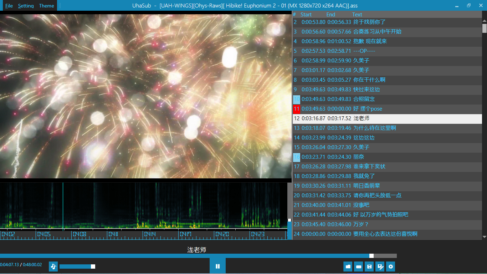
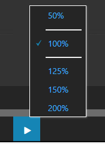
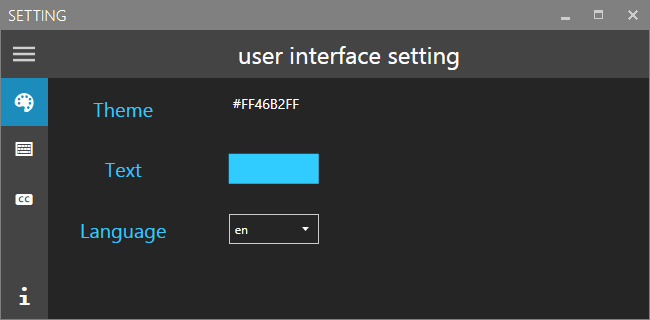
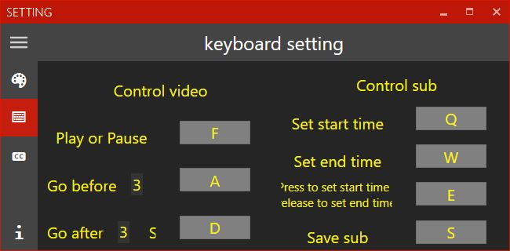

UhaSub
======
This sub is developed as a alternative for popsub.

Download the [last release](./pri/uhasub.zip)

* You can use it like popsub,and it will also provide a audio **Visualization**.

* **Disable** internel sub or show **Current wroking** sub

* Timeline check 
    * start > end        :**red**
    * too long or short  :**gold**
    * overlap with before:**blue**
    
* You can also change **Play Speed** by right click the play button

* In Setting, you can select **Language**,**theme** and custom you **Keyboard Shortcut**
 

Also Thanks for [ffmpeg](https://ffmpeg.org) [libvlc](www.videolan.org/) [Vlc.DotNet](https://github.com/ZeBobo5/Vlc.DotNet) [CsCore](https://github.com/filoe/cscore) and [ColorPicker](https://github.com/AndreasLill/ColorPickerWPF)
